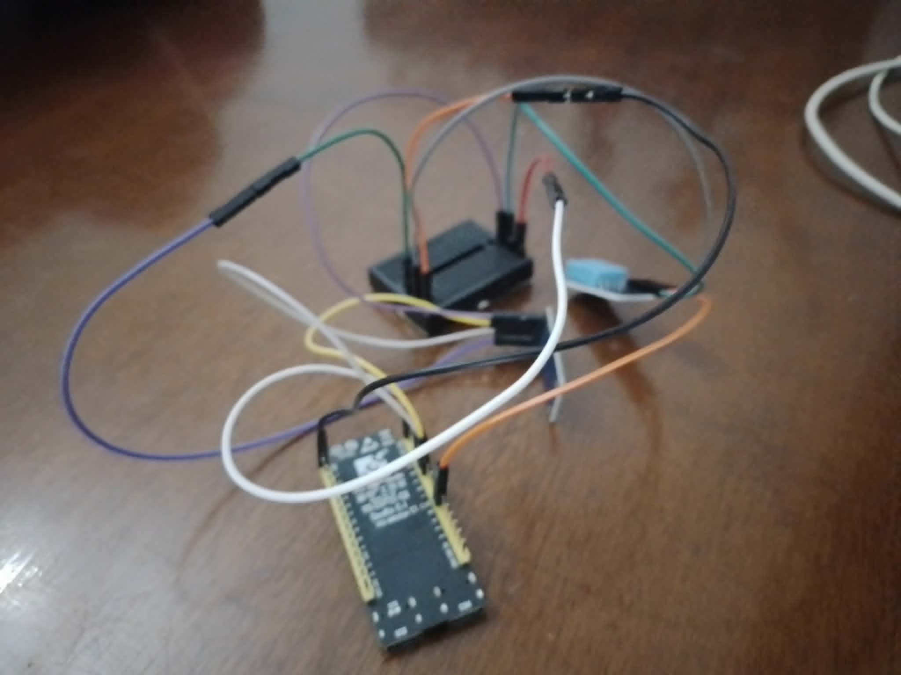

# IoT Sensor Gateway — ESP32 → MQTT → FastAPI Dashboard

Real-time IoT monitoring pipeline: an ESP32-C6 publishes sensor readings over MQTT, a Python subscriber logs them to SQLite, and a FastAPI server streams live updates to a browser dashboard via WebSocket + Chart.js.

## Architecture
## Hardware


## Sensors

- Temperature & Humidity (DHT11)
- Light (BH1750)
- Flame (HW-072A)
- PIR motion PIR HC-SR501
- Gas‎ ‎MQ-2


## Repo structure

> Note: this repo evolved through several prototypes — clean this up before sharing publicly if needed.

- `project V1/`, `project v2/`, `Project V3/`, `Project V4/` — successive iterations of the firmware + backend. **`project v2/your_project/`** contains the current working dashboard (`main.py` FastAPI app + `static/index.html`). `Project V4/main/` has the latest ESP32 firmware (modularized into `.h`/`.cpp` files: `brokerconnection`, `THLP`, `FLGASBUZZ`, `BRGB`, `FRTOS`).
- Top-level `.ino` files (`Flame.ino`, `GasSensor.ino`, `MotionSensor.ino`, `THSensor.ino`, `lightSensor.ino`, `esp32.ino`) — early single-sensor test sketches.
- `mqtt_data.py` (in each project folder) — MQTT subscriber that writes readings to SQLite.
- `iot.bat` / `start_iot_gateway.bat` — Windows launcher scripts that start Mosquitto, the subscriber, and the FastAPI server in sequence.

## Requirements

- Arduino IDE with ESP32 board support, `PubSubClient`, `Adafruit_NeoPixel`
- Python 3.x with `paho-mqtt`, `fastapi`, `uvicorn`
- Mosquitto MQTT broker

## Setup

1. Flash the firmware in `Project V4/main/` to the ESP32-C6 (set your WiFi SSID/password and broker IP in `brokerconnection.h`).
2. Install Mosquitto and start it (`mosquitto -v -c mosquitto.conf`).
3. Update `DB_PATH` in `mqtt_data.py` and run it: `python mqtt_data.py`
4. Update `DB_PATH` in `project v2/your_project/main.py` and run: `uvicorn main:app --host 0.0.0.0 --port 8000`
5. Open `http://localhost:8000` in a browser.

Or run `start_iot_gateway.bat` to launch all three automatically (Windows only, paths are hardcoded — edit them for your machine).

## MQTT Topics

| Topic | Payload |
|---|---|
| `sensors/esp32c6/temp` | float, °C |
| `sensors/esp32c6/humidity` | float, % |
| `sensors/esp32c6/light` | float, lux |

## Database schema (SQLite, table `data`)

```sql
id INTEGER PRIMARY KEY AUTOINCREMENT,
timestamp TEXT,
temperature REAL,
light REAL,
humidity REAL
```
## Earlier visualization (Grafana)


Before switching to the FastAPI + Chart.js dashboard, sensor data was visualized in Grafana (reading from the same SQLite database via the `frser-sqlite-datasource` plugin). Kept here for reference.
## Dashboard

`GET /` — serves the live dashboard
`GET /api/history?limit=100` — recent readings, oldest first (used to pre-populate charts)
`WS /ws` — pushes new rows to connected browsers as they're inserted

